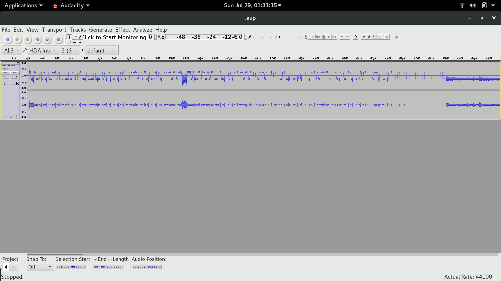

# Music
>Can you do it again?
We are given [DaNang.rar](DaNang.rar)

Looking at the name I was initially hoping for some fancy pitch recognition in base 8 stuff, however it was much easier(and fairer) than that.

Unraring the rar file, we optain a [corrupted png](DaNang.png)

After some time of playing around, DutChen18 found out that after removing the png, you'll get a RIFF file, or just find where RIFF pops up in the png file and remove everything before RIFF, then we get an [audio file](extract.riff).

Opening the riff file with audacity, we immediately see binary data at the start of the file

After painfully writing out the binary data, we get the flag

>Flag: ISITDTU{I_lik3_mus1c_s0_much}
